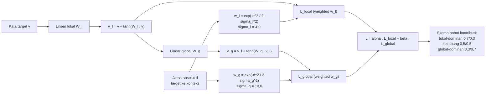
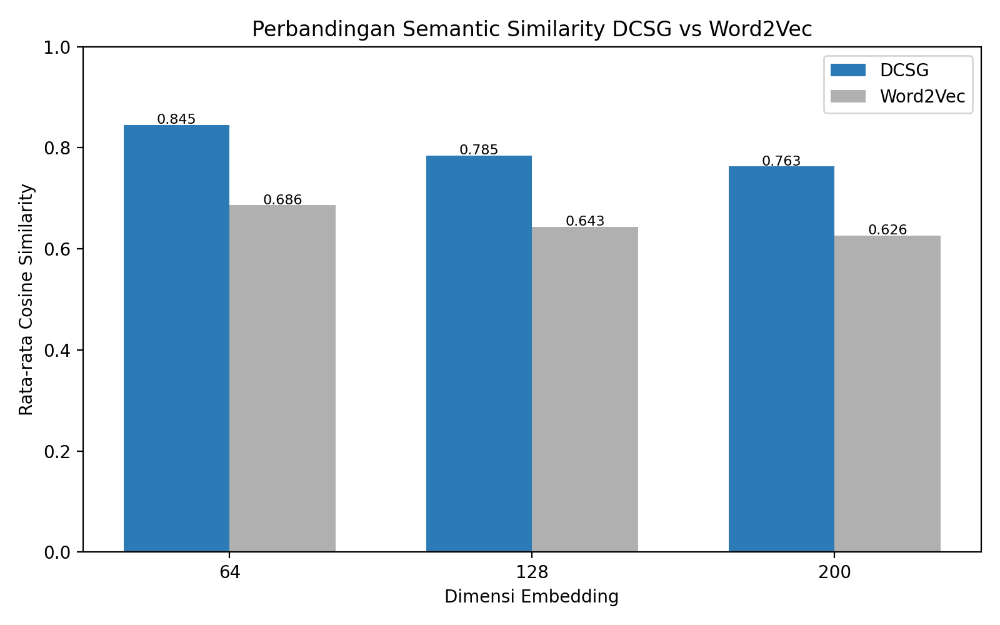
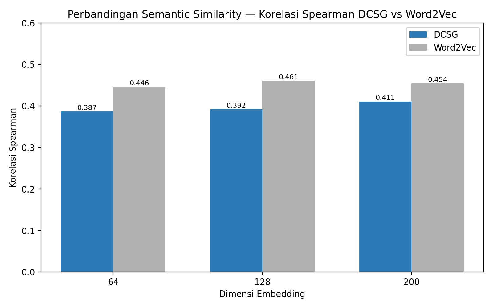
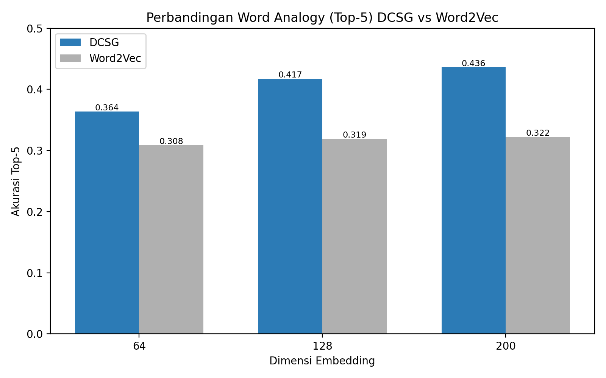
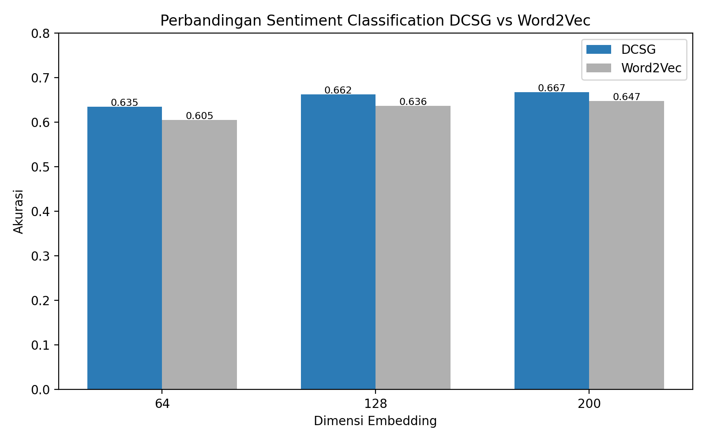
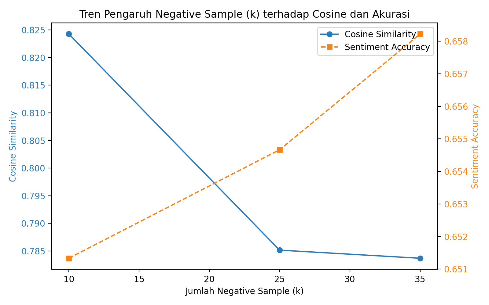
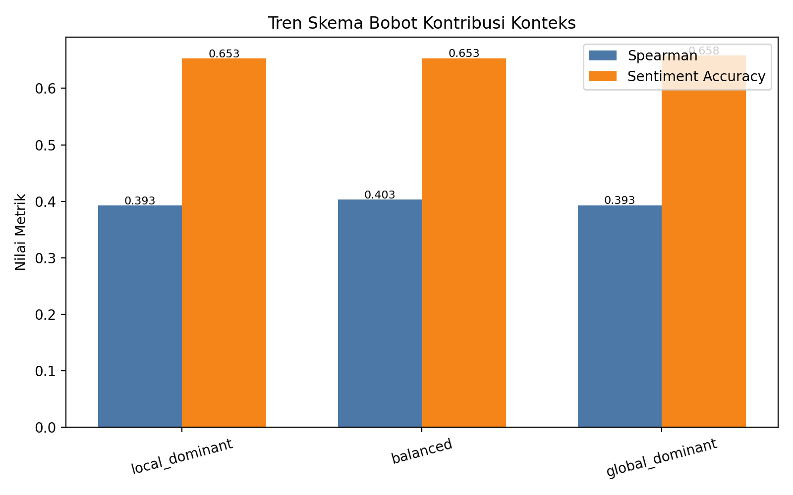
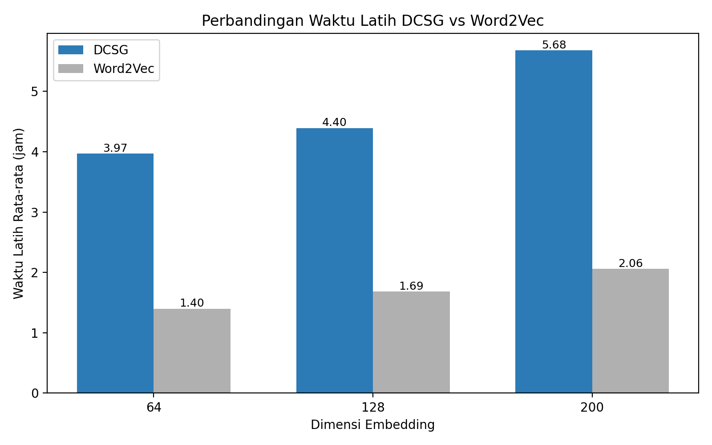
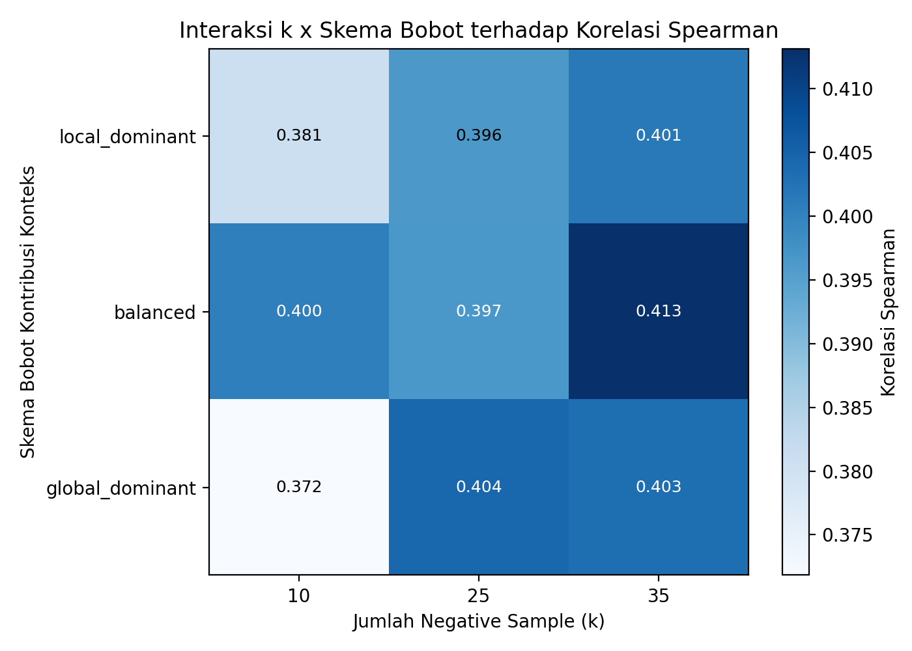
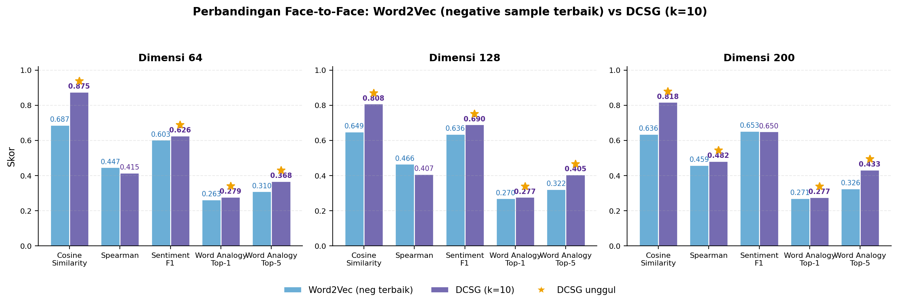

# Distance-Controlled Skip-Gram (DCSG) untuk Representasi Teks Bahasa Indonesia

Dokumentasi tugas akhir untuk DCSG: varian *skip-gram* yang memberi bobot pada kata konteks **berdasarkan jaraknya** dari kata target, dan memisahkan representasi menjadi dua ruang (lokal dan global) secara hierarkis. Repo ini memuat arsitektur, parameter, hasil evaluasi, dan grafik. **Kode sumber eksperimen (notebook Jupyter) tidak dipublikasikan di sini.**

**Rosul Iman** — Program Studi Informatika, Universitas Negeri Padang.

 gensim · PyTorch · 27 konfigurasi model · 25 juta token · kode notebook tidak dipublikasikan

## Ringkasan Hasil

Skip-gram standar memperlakukan semua kata di dalam jendela secara identik. DCSG menggantinya dengan pembobotan Gaussian atas jarak absolut, lalu menyusun representasi bertingkat `lokal -> global` dan mengatur dominasi keduanya lewat bobot kerugian (alpha, beta).

| Tugas | Metrik | DCSG | Word2Vec | Selisih |
|---|---|---|---|---|
| Kemiripan semantik (WordSim-353-id) | rata-rata kosinus | **0,798** | 0,652 | +0,146 |
| Analogi kata (Google Analogy, 19.544 soal) | akurasi top-5 | **0,406** | 0,317 | +0,089 |
| Klasifikasi sentimen (SmSA / IndoNLU) | akurasi | **0,655** | 0,629 | +0,026 |
| Kemiripan semantik | korelasi Spearman | 0,397 | **0,454** | -0,057 |
| Waktu latih rata-rata (dim 200) | jam | 5,68 | **2,06** | 2,5-3x lebih lama |

Kesimpulan jujur: DCSG menang pada tiga dari empat ukuran kualitas, **kalah** pada konsistensi peringkat kemiripan (Spearman), dan membayar itu dengan waktu latih 2,5 sampai 3 kali lebih lama.

## Arsitektur

Tiga komponen: lapisan transformasi lokal, lapisan transformasi global, dan pembobotan distribusi jarak.



Detail lengkap (persamaan, rentang parameter, grid eksperimen) ada di [`docs/ARCHITECTURE.md`](docs/ARCHITECTURE.md).

## Dataset

| Statistik | Nilai |
|---|---|
| Sumber | Wikipedia Bahasa Indonesia, dump 2023 |
| Token | 25.000.074 |
| Artikel | 111.411 |
| Kata unik setelah *preprocessing* | 202.505 (dari 1.542.778 token unik mentah, reduksi 86,9%) |
| Pasangan target-konteks | 22.504.248 |

Alur pembersihan: *lowercasing* -> tokenisasi -> penyaringan kamus KBBI -> buang token non-alfabet -> filter frekuensi minimum 5. Potongan data dipilih acak dengan seed 42.

Dataset mentah (1,4 GB), bobot model, dan kode notebook **tidak** disertakan di repo ini; lihat [Cakupan repo](#cakupan-repo).

## Parameter Eksperimen

- Grid DCSG: 3 dimensi (64, 128, 200) x 3 negative sampling (10, 25, 35) x 3 skema bobot = **27 konfigurasi**.
- Parameter bersama: jendela 25, 10 epoch, learning rate 0,002 (Adam), batch 2048, noise power 0,75.
- Baseline Word2Vec (gensim) pada korpus yang sama: jendela 10, negative sampling 5/10/15, 3 dimensi = **9 model**.
- Konfigurasi terbaik keseluruhan: `dim200_k25_global_dominant`. Lokal-dominan terbaik untuk kemiripan semantik (kosinus 0,8077); global-dominan terbaik untuk sentimen (0,6580).

## Pembahasan Hasil

### Kemiripan semantik



| Dimensi | Kosinus DCSG | Kosinus W2V | Spearman DCSG | Spearman W2V |
|---|---|---|---|---|
| 64 | 0,8452 | 0,6864 | 0,3866 | 0,4456 |
| 128 | 0,7850 | 0,6434 | 0,3920 | 0,4607 |
| 200 | 0,7628 | 0,6262 | 0,4108 | 0,4542 |

Kosinus DCSG lebih tinggi di semua dimensi, tetapi Word2Vec lebih konsisten mengurutkan peringkat pasangan kata. Interpretasinya: DCSG menggeser geometri seluruh ruang vektor (jarak mutlak membaik, urutan relatif tidak).



### Analogi kata



| Dimensi | Top-1 DCSG | Top-1 W2V | Top-5 DCSG | Top-5 W2V |
|---|---|---|---|---|
| 64 | 0,2717 | 0,2628 | 0,3635 | 0,3085 |
| 128 | 0,2764 | 0,2688 | 0,4172 | 0,3190 |
| 200 | 0,2759 | 0,2692 | 0,4360 | 0,3219 |

Keunggulan terbesar ada di top-5 (ruang kandidat), bukan top-1. Pada top-1 selisihnya nyaris tipis.

### Sentimen



| Dimensi | Akurasi DCSG | Akurasi W2V | F1 DCSG | F1 W2V |
|---|---|---|---|---|
| 64 | 0,6347 | 0,6047 | 0,6229 | 0,5954 |
| 128 | 0,6624 | 0,6360 | 0,6513 | 0,6282 |
| 200 | 0,6671 | 0,6473 | 0,6562 | 0,6372 |

### Tren parameter dan biaya latih

 

 

Perbandingan ringkas satu layar:



## Cakupan Repo

```
docs/               ARCHITECTURE.md, REFERENCES.md
results/            13 CSV (27 konfigurasi DCSG, 9 W2V, tren, waktu latih)
assets/charts/      13 PNG hasil evaluasi
scripts/            generate_grafik_bab4.py
```

Ada di repo ini: arsitektur model beserta persamaannya, parameter grid lengkap, seluruh
metrik evaluasi dalam bentuk CSV, dan grafik yang dibangun ulang dari CSV itu.

Tidak ada di repo ini: **notebook Jupyter** tempat pelatihan dan evaluasi dijalankan,
korpus mentah (1,4 GB dump Wikipedia 2023), dan bobot model hasil latih.

### Mereproduksi grafik

`scripts/generate_grafik_bab4.py` membaca `results/` dan menulis PNG ke `assets/charts/`.
Ini satu-satunya kode yang dipublikasikan, dan ia tidak membutuhkan dataset maupun bobot
model.

## Angka Tanpa Kode

Setiap tabel di halaman ini punya barisnya sendiri di `results/`, jadi klaimnya bisa
diperiksa tanpa menjalankan apa pun:

| Tabel di README | Sumber CSV |
|---|---|
| Ringkasan Hasil | `result_comparison.csv` |
| 27 konfigurasi DCSG | `lampiran_hasil_lengkap_27_konfigurasi_dcsg.csv` |
| 9 baseline Word2Vec | `lampiran_hasil_lengkap_9_konfigurasi_word2vec.csv` |
| Tren dimensi / k / skema | `tabel_tren_dimensi.csv`, `tabel_tren_k.csv`, `tabel_tren_skema.csv` |
| Waktu latih | `train_time_summary.csv`, `train_time_w2v.csv` |

## Catatan Publikasi

- Kode eksperimen ditulis sebagai notebook Jupyter dan dijalankan di Google Colab. Kode itu
  sengaja tidak dipublikasikan; repo ini memuat dokumentasi, hasil, dan grafiknya saja.
- Tidak ada dataset, bobot model (`*.model`, `*.pkl`, `*.npy`), atau dokumen skripsi/PDF di
  repo ini.
- Repo pihak ketiga yang dipakai sebagai benchmark (indonlu, KBBI-SQL-database, SemRel2024)
  tidak disalin; punya lisensinya masing-masing.

Benchmarks yang digunakan: WordSim-353 versi bahasa Indonesia, Google Analogy Dataset (19.544 soal), SmSA dari IndoNLU, serta IndoLEM, SemRel 2024, dan KBBI sebagai pembanding metodologi dan filter leksikal. Detail dan status verifikasinya ada di [`docs/REFERENCES.md`](docs/REFERENCES.md).

## Referensi Ilmiah

Daftar lengkap dengan DOI ada di [`docs/REFERENCES.md`](docs/REFERENCES.md). Inti:

- Mikolov, Chen, Corrado, Dean (2013). *Efficient Estimation of Word Representations in Vector Space*. arXiv:1301.3781.
- Mikolov, Sutskever, Chen, Corrado, Dean (2013). *Distributed Representations of Words and Phrases and their Compositionality*. NeurIPS.
- Levy, Goldberg (2014). *Neural Word Embedding as Implicit Matrix Factorization*. NeurIPS.
- Pennington, Socher, Manning (2014). *GloVe: Global Vectors for Word Representation*. EMNLP.
- Vaswani et al. (2017). *Attention Is All You Need*. NeurIPS.
- Finkelstein et al. (2001). *Placing Search in Context: The Concept Revisited*. WWW.
- Purwarianti, Crisdayanti (2019). *Improving bi-LSTM Performance for Indonesian Sentiment Analysis Paragraph-Level*. ICAICTA.
- Koto, Rahimi, Lau, Baldwin (2020). *IndoLEM and IndoBERT*. COLING.
- Wilie et al. (2020). *IndoNLU: Benchmark and Resource for Evaluating Indonesian NLU*. EMNLP Findings.

## Lisensi

- Kode yang ada di repo ini (`scripts/generate_grafik_bab4.py`, `results/`, `assets/charts/`): **MIT License** — lihat [LICENSE](LICENSE). Bebas dipakai, dimodifikasi, dan dijadikan rujukan dengan mencantumkan pemberitahuan hak cipta.
- Notebook Jupyter tempat model dilatih dan dievaluasi tidak dipublikasikan, sehingga tidak termasuk cakupan lisensi ini.
- Teks tugas akhir dan artikel jurnal tidak termasuk lisensi ini dan tidak dipublikasi di repo ini.
- Dataset dan benchmark pihak ketiga (Wikipedia, WordSim-353-id, Google Analogy, SmSA/IndoNLU, IndoLEM, KBBI) tetap tunduk pada lisensi sumber aslinya masing-masing; tidak ada bagiannya yang ikut ter-ekselusi di sini.
- Bobot model hasil pelatihan tidak disertakan, dan pelatihan ulang dari repo ini tidak bisa dilakukan. Angka yang tersedia di `results/` adalah hasil jalan tersebut.

## Sitasi

```bibtex
@misc{iman2026dcsg,
  title  = {Distance-Controlled Skip-Gram dengan Representasi Konteks Lokal-Global untuk Bahasa Indonesia},
  author = {Rosul Iman and Muhammad Anwar and Yeka Hendriyani and Khairi Budayawan},
  year   = {2026},
  note   = {Undergraduate thesis, Universitas Negeri Padang}
}
```
