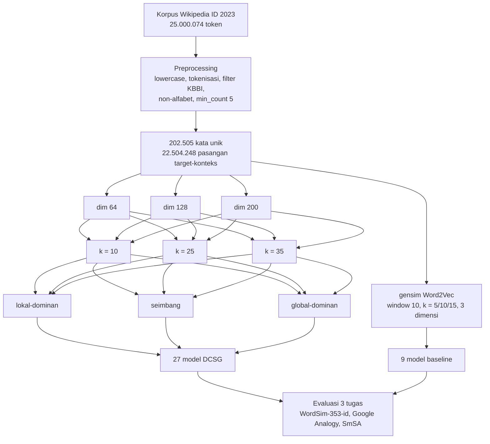

# Arsitektur DCSG

Dokumen ini adalah versi ringkas dari artikel "Perancangan Arsitektur Distance-Controlled Skip-Gram untuk Representasi Teks Bahasa Indonesia".

## 1. Masalah

Skip-gram dengan negative sampling (Mikolov et al., 2013) memaksimalkan probabilitas setiap kata konteks di dalam jendela dengan bobot yang sama. Posisi relatif kata konteks terhadap kata target diabaikan, padahal kata yang lebih dekat umumnya punya ikatan sintaktik lebih kuat, dan kata yang lebih jauh menyumbang makna wacana.

## 2. Dua ruang representasi

Setiap kata punya vektor `v`. Representasi konteks dibentuk bertingkat:

```
v_l = v + tanh(W_l . v)          (lokal)
v_g = v_l + tanh(W_g . v_l)      (global, dibangun di atas lokal)
```

Bentuk residual + tanh menjaga agar ruang global tetap merupakan transformasi kecil dari ruang lokal, sehingga informasi kedekatan tidak hilang ketika model belajar pola jarak jauh.

## 3. Pembobotan distribusi jarak

Untuk kata konteks pada jarak absolut `d` dari target:

```
w_l = exp(-d^2 / (2 . sigma_l^2)),   sigma_l = 4,0
w_g = exp(-d^2 / (2 . sigma_g^2)),   sigma_g = 10,0
```

sigma_l kecil memberi puncak tajam pada konteks dekat; sigma_g besar membuat konteks jauh tetap terhitung dengan bobot landai. Gaussian dipilih karena penurunan bobotnya halus, berbeda dengan pembobotan linear atau diskrit.

## 4. Fungsi kerugian

```
L = alpha . L_local + beta . L_global
```

| Skema | alpha | beta | Karakter |
|---|---|---|---|
| Lokal-dominan | 0,7 | 0,3 | terbaik untuk kemiripan semantik (kosinus 0,8077) |
| Seimbang | 0,5 | 0,5 | tengah |
| Global-dominan | 0,3 | 0,7 | terbaik untuk sentimen (akurasi 0,6580) |

Negative sampling memakai distribusi noise frekuensi pangkat 0,75, identik dengan Word2Vec, agar perbandingan baseline adil.

## 5. Grid eksperimen



Parameter bersama: jendela 25, epoch 10, learning rate 0,002 (Adam), batch 2048.

## 6. Preprocessing

| Statistik | Nilai |
|---|---|
| Token unik mentah | 1.542.778 |
| Token unik setelah filter | 202.505 |
| Reduksi | 86,9% |

Tahapan: lowercasing, tokenisasi berbasis spasi, penyaringan kosakata baku KBBI, penghapusan token berisi karakter non-alfabet, filter frekuensi minimum 5, pemotongan acak ke target 25 juta token dengan seed 42.

## 7. Batasan arsitektur

- Korelasi Spearman DCSG (0,397) di bawah Word2Vec (0,454): pembobotan jarak menaikkan kemiripan rata-rata tetapi mengompresi urutan peringkat.
- Biaya latih 2,5-3x lebih lama karena dua lintasan loss dan pembobotan per pasangan.
- σ_l dan σ_g ditetapkan manual, bukan dipelajari.
